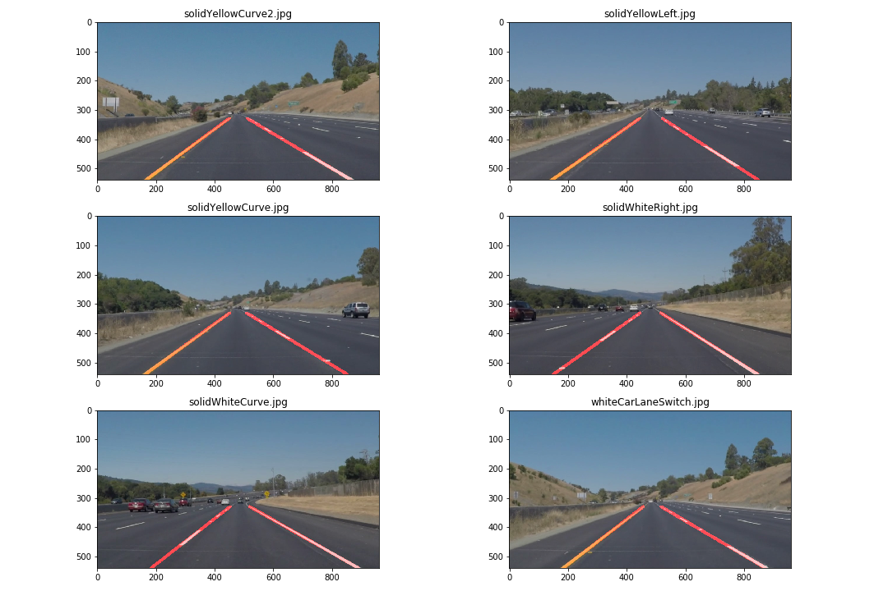

# Finding Lane Lines on the Road

My submission of Udacity Self Driving Car Term1, Project 1. This project employs computer vision techniques to extract lane lines from image and video.

## Overview

When we drive, we use our eyes to decide where to go.  The lines on the road that show us where the lanes are act as our constant reference for where to steer the vehicle.  Naturally, one of the first things we would like to do in developing a self-driving car is to automatically detect lane lines using an algorithm.

## Final output on video

## Lanes detected on test images

## Submission

- [IPython notebook](P1.ipynb)
- [Project write up](writeup_khanh_nguyen.md)

You might need to follow instructions on [CarND Term1 Starter Kit](https://github.com/udacity/CarND-Term1-Starter-Kit/blob/master/README.md) before running the notebook.

All Udacity SDC Term 1 Projects
---

- [Project 1: Finding Lane Lines](https://github.com/knguyen0105/CarND-LaneLines-P1)
- [Project 2: Traffic Sign Classifier](https://github.com/knguyen0105/CarND-Traffic-Sign-Classifier)
- [Project 3: Behavior Cloning ](https://github.com/knguyen0105/CarND-Behavioral-Cloning-P3v)
- [Project 4: Advanced Lane Finding ](https://github.com/knguyen0105/CarND-Advanced-Lane-Lines)
- [Project 5: Vehicle Detection](https://github.com/knguyen0105/CarND-Vehicle-Detection)
